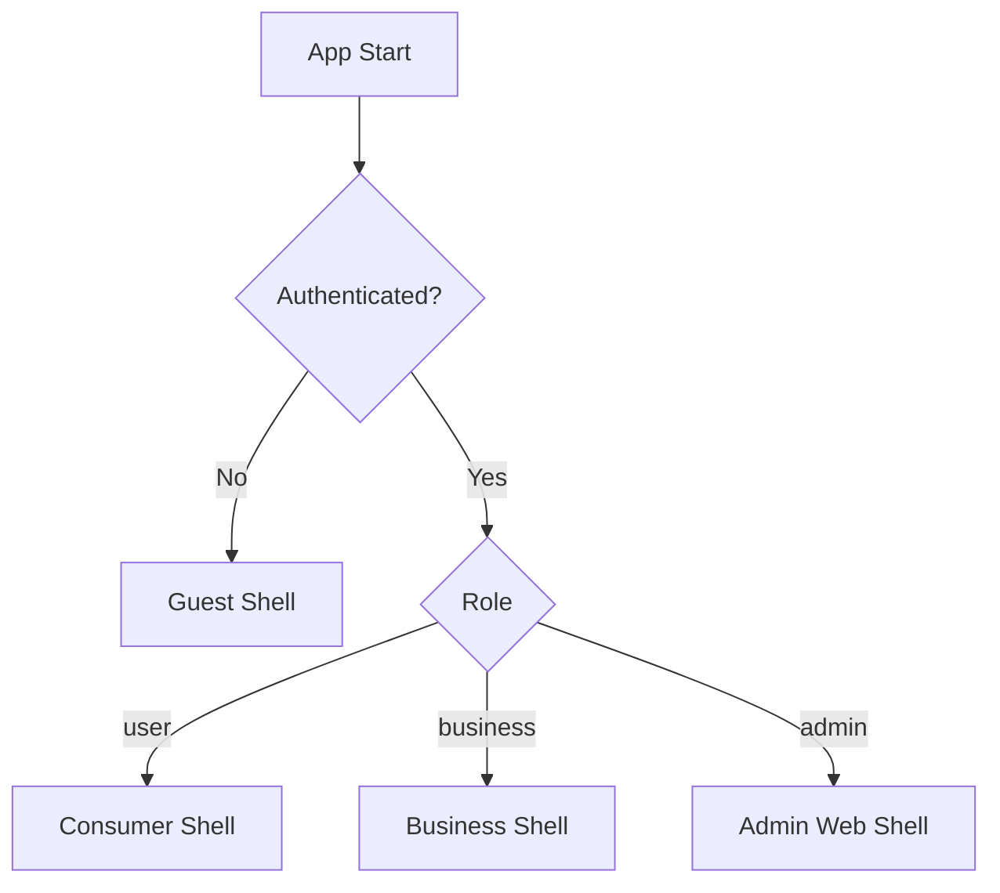

# Fudi System Architecture

## Principios

- Clean Architecture
- Feature-First
- Un solo código para mobile + web
- Guards por auth state y por rol
- Observabilidad y accesibilidad desde el diseño

## Stack

| Capa | Tecnología |
| --- | --- |
| App | Flutter |
| Estado | Riverpod |
| Backend | Supabase |
| Observabilidad | Sentry |
| Mapas | Google Maps / geolocalización |
| Pagos | Pasarela externa encapsulada |
| Push | FCM o proveedor equivalente + backend de preferencias |

## Modelo de roles

- `guest`: estado no autenticado en cliente
- `user`: perfil consumidor autenticado
- `business`: perfil de negocio autenticado
- `admin`: administración de plataforma

## Navegación de alto nivel



## Módulos recomendados

```text
lib/
  core/
    config/
    constants/
    di/
    error/
    network/
    observability/
    routing/
    utils/
    widgets/
  features/
    auth/
    home/
    explore/
    offers/
    orders/
    profile/
    notifications/
    business/
    admin/
    landing/
  shared/
```

## Decisiones arquitectónicas

### 1. Guest no persiste como role

Correcto porque no representa una identidad de negocio sino ausencia de autenticación. Persistirlo complica permisos y analítica.

### 2. Sin carrito en fase 1

Correcto para un modelo de paquetes escasos y pickup inmediato. Reduce complejidad en inventario, pagos, expiración y UX.

### 3. Delivery solo como extensión futura

Diseñar extensiones, por ejemplo:

- `fulfillment_method` con default `pickup`
- adaptadores separados para logística
- pantallas y casos de uso aislados para una fase futura

Sin embargo, **no exponer delivery en UI ni en reglas activas de fase 1**.

### 4. Admin y business comparten codebase, no experiencia

Comparten repositorio y componentes base, pero no navegación ni permisos.

## Supabase de alto nivel

Tablas esperadas en primera versión:

- `profiles`
- `businesses`
- `offers`
- `orders`
- `order_events`
- `device_tokens`
- `user_preferences`

## Seguridad

- RLS obligatoria desde el inicio
- separación por ambiente: `dev`, `test`, `prod`
- secretos fuera del repositorio
- validación de pagos y lógica crítica en backend/edge functions

## Observabilidad

- Sentry inicializado por ambiente
- tags mínimas: `environment`, `role`, `feature`
- logs útiles, no spam

## Accesibilidad

- WCAG AA
- semantics en elementos interactivos
- contraste, foco y escalado de texto
