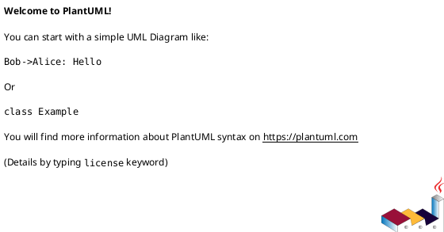

# Diagramas de Base de Datos

## Generación de Diagramas

Para generar diagramas ERD a partir de los esquemas SQL:

### Opción 1: dbdocs (Recomendado)

```bash
# Instalar dbdocs
npm install -g dbdocs

# Generar diagrama desde schema
dbdocs build schemas/001_initial.sql
```

### Opción 2: SchemaSpy

```bash
# Con Docker
docker run --rm -v $(pwd):/schemas schemaspy/schemaspy \
  -t pgsql -schemas /schemas/schemas/ -o diagrams/
```

### Opción 3: DBeaver

1. Conectar a la base de datos
2. Seleccionar tablas
3. Right-click > Generate ERD

### Opción 4: PlantUML



## Convenciones de Diagramas

- Tablas en rectángulos con columnas y tipos
- Relaciones con líneas y cardinalidad
- Índices marcados con asterisco
- Foreign keys con flechas
- RLS policies en notas adjuntas
